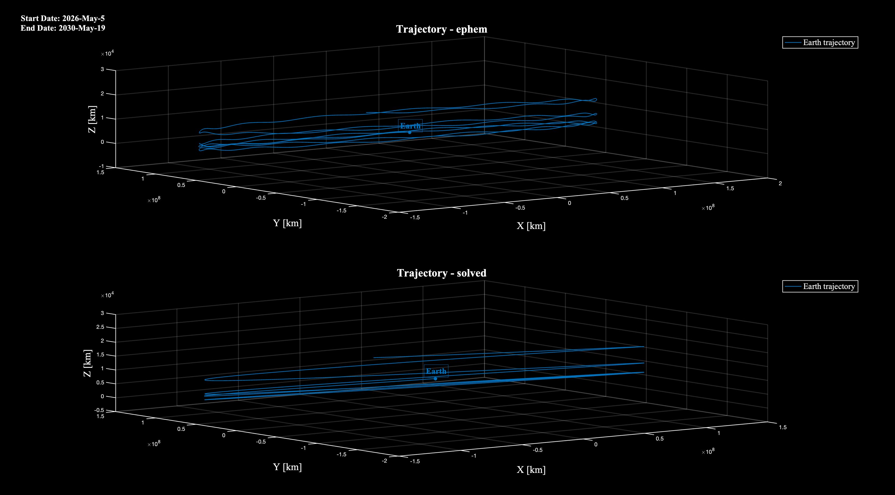
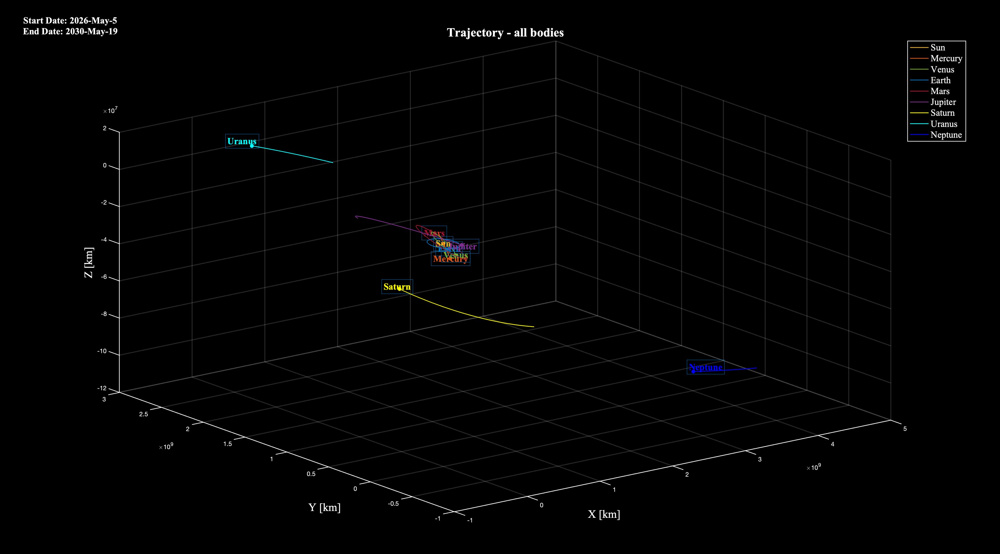

# Solar System Orbital Propagator

MATLAB-based numerical simulation of the Solar System using a fully coupled N-body gravitational model and classical fourth-order Runge-Kutta integration.

## Overview

The goal of this project is to numerically solve the equations of motion of the Solar System, overcoming the limitations of analytical approaches to the general N-body problem, for which no general closed-form solution exists.

The physical system considered consists of the Sun and the eight planets of the Solar System. The gravitational interaction between all bodies is explicitly modeled, resulting in a coupled system of nonlinear differential equations.

The initial conditions are obtained from NASA/JPL Horizons ephemeris data, while the resulting trajectories can be propagated numerically and compared against the corresponding ephemeris data.

### Main Features

- Fully coupled N-body gravitational model
- Sun + eight planets
- Mutual gravitational interactions between all bodies
- Classical fourth-order Runge-Kutta (RK4) integration
- Initial conditions retrieved from NASA/JPL Horizons
- Solar System barycentric or Sun-centered reference frame
- km/day or km/s unit systems
- Multi-year orbital propagation
- 3D trajectory visualization
- Comparison with NASA/JPL ephemeris data
- Earth trajectory animation

---

## Mathematical Model

For each body, the state vector is defined as

```math
\mathbf{x}_i =
\begin{bmatrix}
\mathbf{r}_i \\
\mathbf{v}_i
\end{bmatrix}
=
\begin{bmatrix}
x_i & y_i & z_i & v_{x,i} & v_{y,i} & v_{z,i}
\end{bmatrix}^{T}
```

where $\mathbf{r}_i$ and $\mathbf{v}_i$ are the position and velocity vectors of body $i$.

The system contains $N=9$ bodies: the Sun and the eight planets. The complete state vector therefore has $6N=54$ states:

```math
\mathbf{x} =
\begin{bmatrix}
\mathbf{x}_1 \\
\mathbf{x}_2 \\
\vdots \\
\mathbf{x}_N
\end{bmatrix}
\in \mathbb{R}^{6N}
```

For each body, the equations of motion are

```math
\dot{\mathbf{r}}_i = \mathbf{v}_i
```

and

```math
\dot{\mathbf{v}}_i =
G
\sum_{\substack{j=1\\j\neq i}}^{N}
m_j
\frac{\mathbf{r}_j-\mathbf{r}_i}
{\left\|\mathbf{r}_j-\mathbf{r}_i\right\|^3}
```

where:

- $G$ is the universal gravitational constant
- $m_j$ is the mass of body $j$
- $\mathbf{r}_i$ and $\mathbf{r}_j$ are the positions of bodies $i$ and $j$

The resulting system is nonlinear and fully coupled because the acceleration of each body depends on the position of every other body.

The right-hand side of the differential system is implemented in `BuildFunction.m`.

---

## Numerical Integration

The equations of motion are integrated using the classical fourth-order Runge-Kutta method.

The system has the form

```math
\dot{\mathbf{x}} = F(\mathbf{x})
```

Since the gravitational model depends only on the current state, the system is time-invariant:

```math
F = F(\mathbf{x})
```

rather than

```math
F = F(t,\mathbf{x})
```

For a time step $\Delta t$, the RK4 method computes

```math
\mathbf{k}_1 = F(\mathbf{x}_n)
```

```math
\mathbf{k}_2 =
F\left(
\mathbf{x}_n +
\frac{\Delta t}{2}\mathbf{k}_1
\right)
```

```math
\mathbf{k}_3 =
F\left(
\mathbf{x}_n +
\frac{\Delta t}{2}\mathbf{k}_2
\right)
```

```math
\mathbf{k}_4 =
F\left(
\mathbf{x}_n +
\Delta t\,\mathbf{k}_3
\right)
```

The state is then updated according to

```math
\mathbf{x}_{n+1}
=
\mathbf{x}_n+
\frac{\Delta t}{6}
\left(
\mathbf{k}_1+
2\mathbf{k}_2+
2\mathbf{k}_3+
\mathbf{k}_4
\right)
```

The RK4 algorithm is implemented directly in `main.m`, while `BuildFunction.m` evaluates the right-hand side of the differential system.

---

## Gravitational Model

The acceleration of each body is obtained by summing the gravitational contribution of every other body.

For body $i$:

```math
\mathbf{a}_i =
G
\sum_{\substack{j=1\\j\neq i}}^{N}
m_j
\frac{\mathbf{r}_j-\mathbf{r}_i}
{\left\|\mathbf{r}_j-\mathbf{r}_i\right\|^3}
```

The implementation therefore accounts for the mutual gravitational interaction between all nine modeled bodies.

The gravitational constant is converted from SI units to the selected simulation unit system. The default configuration uses:

```text
Position: km
Velocity: km/day
Time:     day
```

---

## Ephemeris Data

Initial conditions are retrieved from the NASA/JPL Horizons API.

The function `extractEphemeris.m` communicates directly with the Horizons API and retrieves Cartesian state vectors for:

- Sun
- Mercury
- Venus
- Earth
- Mars
- Jupiter
- Saturn
- Uranus
- Neptune

The corresponding Horizons body identifiers are defined directly in `extractEphemeris.m`.

The API is queried using the `VECTORS` ephemeris type, retrieving position and velocity information for each body.

### Reference Frames

Two reference frames are available:

| Flag | Reference frame |
|---:|---|
| `1` | Solar System barycenter |
| `0` | Sun |

The corresponding Horizons centers are:

```text
500@0   → Solar System barycenter
500@10  → Sun
```

### Units

Two unit systems are supported:

| Flag | Position | Velocity |
|---:|---|---|
| `1` | km | km/day |
| `0` | km | km/s |

The default configuration uses km and km/day.

---

## Validation

When the complete ephemeris is retrieved, the numerical solution can be compared directly against the corresponding NASA/JPL Horizons trajectory.

For example, the Earth trajectory can be plotted using both:

- NASA/JPL ephemeris data
- Numerical N-body propagation

This provides a direct visual comparison between the reference ephemeris and the numerically propagated solution.

The comparison is enabled by setting:

```matlab
onlyIC_flag = 0;
```

When only the initial conditions are required, the following configuration can be used:

```matlab
onlyIC_flag = 1;
```

In this case, only the initial conditions are extracted and the complete ephemeris trajectory is not retrieved.

This option is particularly useful for long propagation intervals, where downloading the complete ephemeris data would require additional time.

---

## Running the Simulation

### Requirements

- MATLAB
- Internet connection
- Access to the NASA/JPL Horizons API

### Quick Start

Open the repository directory in MATLAB and run:

```matlab
main
```

`main.m` is the only script that needs to be executed directly.

The simulation parameters and visualization options can be configured at the beginning of the file.

---

## Configuration

All user-configurable options are located in the `CUSTOMIZE` section of `main.m`.

### Unit System

```matlab
unit = 1;
```

Available options:

| Value | Position | Velocity |
|---:|---|---|
| `1` | km | km/day |
| `0` | km | km/s |

The default configuration is `unit = 1`.

### Reference Frame

```matlab
frame = 1;
```

Available options:

| Value | Reference frame |
|---:|---|
| `1` | Solar System barycenter |
| `0` | Sun |

### Plotting

```matlab
plot_flag = 1;
```

- `1` → enable trajectory plots
- `0` → disable plotting

### Animation

```matlab
animation_flag = 0;
```

- `1` → enable Earth trajectory animation
- `0` → disable animation

### Earth-Only Visualization

```matlab
onlyEarth_flag = 0;
```

- `1` → display only the Earth trajectory
- `0` → display the trajectories of all bodies

### Ephemeris Extraction

```matlab
onlyIC_flag = 1;
```

- `1` → retrieve only the initial conditions
- `0` → retrieve the complete ephemeris

When `onlyIC_flag = 1`, the simulation uses the initial state obtained from NASA/JPL and performs the complete numerical propagation without downloading the full reference trajectory.

---

## Simulation Interval

The propagation interval is defined directly in `main.m`.

The default configuration is:

```matlab
startTime = '2026-May-5';
stopTime  = '2030-May-19';
```

The corresponding MATLAB `datetime` objects define the total simulation interval.

---

## Integration Step

The integration step is defined by:

```matlab
dt = 1; % [day]
```

The default simulation therefore uses a one-day integration step.

Reducing the integration step increases the temporal resolution of the numerical solution but also increases the number of RK4 iterations and the computational cost.

---

## State Representation

The system contains nine bodies, each represented by six states:

```math
\mathbf{x}_i =
\begin{bmatrix}
x_i &
y_i &
z_i &
v_{x,i} &
v_{y,i} &
v_{z,i}
\end{bmatrix}^{T}
```

Therefore, the complete state vector contains

```math
9 \times 6 = 54
```

states:

```math
\mathbf{x} \in \mathbb{R}^{54}
```

The state history is stored in the matrix `x`.

The matrix is organized such that:

- **Rows** correspond to the position and velocity components of the bodies
- **Columns** correspond to the different integration time steps

For each body, the six states are stored consecutively:

```text
[x, y, z, vx, vy, vz]
```

---

## Visualization

The project provides several visualization modes.

### Earth Trajectory

When `onlyEarth_flag = 1`, the numerical Earth trajectory is plotted in 3D.

If the complete ephemeris has also been retrieved, the reference and numerical trajectories are displayed separately for comparison.

### All Bodies

When `onlyEarth_flag = 0`, the trajectories of the Sun and all eight planets are plotted simultaneously.

The position coordinates are displayed in kilometers:

```text
X [km]
Y [km]
Z [km]
```

### Earth Animation

The animation option progressively displays the evolution of the Earth trajectory throughout the simulation.

It can be enabled using:

```matlab
animation_flag = 1;
```

The animation can also display the corresponding NASA/JPL ephemeris trajectory when `onlyIC_flag = 0`.

---

## Repository Structure

```text
SolarSystem/
│
├── main.m
├── BuildFunction.m
├── extractEphemeris.m
├── stylePlot.m
├── README.md
│
├── assets/
│   ├── all_bodies.png
│   └── earth.png
│
└── outdated_scripts/
    └── main_outdated.m
```

### `main.m`

Main simulation script.

It:

1. Defines the simulation configuration
2. Defines the physical parameters
3. Retrieves the required NASA/JPL ephemeris data
4. Initializes the complete state vector
5. Numerically propagates the system using RK4
6. Generates the requested plots
7. Optionally generates the Earth trajectory animation

This is the only script that needs to be executed directly.

### `BuildFunction.m`

Defines the right-hand side of the N-body differential system.

For each body, it computes:

- Position derivatives from velocity
- Gravitational acceleration generated by all other bodies

The function receives the current state, body masses, and gravitational constant and returns the derivative of the complete state vector.

### `extractEphemeris.m`

Handles the extraction of NASA/JPL Horizons ephemeris data.

It:

1. Defines the requested units
2. Defines the reference frame
3. Queries the Horizons API for each modeled body
4. Extracts Cartesian position and velocity data
5. Builds the initial state vector
6. Optionally stores the complete reference trajectories

### `stylePlot.m`

Handles the formatting of the MATLAB figures.

It configures:

- Figure background
- Axes background
- Font
- Labels
- Titles
- Grid
- Legend
- Text formatting

The visualization uses a dark background with white axes, labels, and grid elements.

### `assets/`

Contains example figures generated by the simulation and displayed in this README.

### `outdated_scripts/`

Contains previous versions of scripts that are no longer part of the main simulation workflow.

---

## Results

### Earth Trajectory

The Earth trajectory can be visualized using the numerical N-body propagation and, when requested, compared against the NASA/JPL reference ephemeris.



### Solar System

The numerical propagator simultaneously integrates the trajectories of the Sun and all eight planets.



---

## Model Assumptions

The current implementation models the Solar System using Newtonian point-mass gravitational dynamics.

The implemented model therefore does not include additional perturbation effects such as:

- Atmospheric drag
- Solar radiation pressure
- Planetary oblateness
- Relativistic corrections
- Non-gravitational forces

The current implementation focuses on the mutual gravitational interaction between the nine explicitly modeled bodies.

---

## Possible Extensions

The current architecture could be extended to incorporate higher-fidelity force models and additional functionality, such as:

- Additional perturbation forces
- Higher-order planetary gravity models
- Relativistic corrections
- Adaptive integration schemes
- Numerical error analysis
- Conservation of energy and angular momentum analysis
- Comparison against additional ephemeris datasets

---

## References

- NASA/JPL Horizons System
- Newton's Law of Universal Gravitation
- Classical fourth-order Runge-Kutta numerical integration

