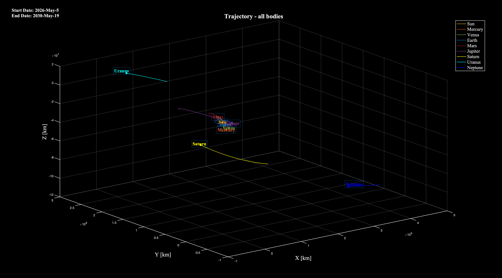

# Solar System
The goal of this project is to overcome the limitations of the analytical solution of the N-body problem, which does not admit a general closed-form solution, by implementing a numerical method to solve the equations of motion.

The physical system considered includes the Sun and the eight planets of the Solar System, each influenced by the gravitational interaction with all other bodies.

The equations of motion for each body are derived by applying Newton's Law of Universal Gravitation within the framework of Newton’s Second Law of Dynamics, accounting for the mutual interactions among all bodies in the system.

This leads to a system of coupled differential equations, which is solved numerically using the classical fourth-order Runge-Kutta (RK4) method.

Below is a brief overview of the implemented method:

### RK4 derivation method

      x_i+1 = x_i + dt*sum_i(b_i * k_i)
      ki = F(t + c_i*dt, x + dt*sum_j(a_ij * k_j)

      with:   F = F(t, x)
              a_ij, b_i, c_i from Butcher Tableau

      Butcher Tableau for RK4
      | c1: 0                                                     |
      | c2: 0.5      a21: 0.5                                     |
      | c3: 0.5      a31: 0       a32: 0.5                        |
      | c4: 1        a41: 0       a42: 0      a43: 1              |
      |              b1: 1/6      b2: 1/3     b3: 1/3     b4: 1/6 |

      so:      
      k1 = f( t, x )
      k2 = f( t + 0.5*dt, x + dt*(0.5*k1) )
      k3 = f( t + 0.5*dt, x + dt*(0.5*k2) )
      k4 = f( t + dt, x + dt*(1*k3) )

      x_i+1 = x_i + dt*[ (1/6 * k1) + (1/3 * k2) + (1/3 * k3) + (1/6 * k4) ] 
      
  Note: in our case, the system is time-invariant:
      f = f(x), not f = f(t, x)

## Repository description
The whole repository is composed of four files, respectively:
- main.m: main script. Users will run just this file;
- extractEphemeris.m: function responsible for the ephemeris' extractions of the bodies involved in the system; taken directly from NASA JPL Archives
- BuildFunction.m: function resposible for the construction of the right-hand side of the system of differential equations
- stylePlot.m: function that manages all the optimal styling options required for a better visualization of the results.

A better description of the main.m file is proposed.
main.m is the only script that the user will have to run. In order to not compromise the code, it is highly suggested to do not edit other functions.  
The script is divided into sections:
### Customize:
At the right beginning of the file, the user can set some parameters and flags in order to customize the plotting procedure.
The flags presented are:
- unit [0, 1]: set the unit of measurements between 1: [day, Km/day] and 0: [seconds, Km/s]. It is suggested to set input = 1;
- frame [0, 1]: set the origin of the reference frame between 1: [Solar system baricenter] and 0: [Sun];
- plot_flag [0, 1]: choose to plot the trajectories computed right after the integration of the system of differential equations;
- animation_flag [0, 1]: choose to produce an animation of the Earth trajectory evolution through time;
- onlyEarth_flag [0, 1]: choose to display only the Earth trajectory on the plots
- onlyIC_flag [0, 1]: choose to extract from the ephemeris only the initial conditions for each body, and not the whole data. It is highly recommended when, for instance,
the integration interval is very big (tens of years), and the extraction process might take a while. If selected, then the comparison between the solved trajectory and the ephemeris won't be showed.

### Parameters:
This section contains some definitions of constant parameters (they don't require to be changed), such as the mass of the bodies, the radius, Universal Gravitational Constant, UA and so on.

### Problem Initialization & Solve differential system
The problem is finally initialized and numerically solved throught the implementation of the RK4 integration method.
At the end of the integration, the matrix "x" of the system's states is outputted. In particular:
- rows -> Coordinate integrated (position and velocity of the body)
- columns -> valuation throught time

### Plot (& animation)
This final section is dedicated to the plotting logic.
Three kinds of plots are proposed:
- Earth trajectory (eventually compared with the Ephemeris previously extracted)
- Trajectories of all the bodies of the Solar System
- Animation of the Earth trajectory

## Exemples
Here's are reported some self-explaining plot examples.

          
          

